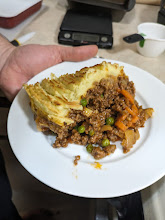
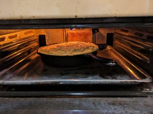
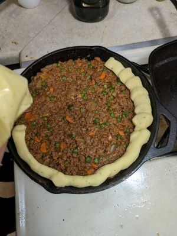

## Ingredients

Crust: 

- 2 lbs potatoes (russet or yukon gold)
- 1/2 c milk
- 1 large egg
- 4 tbs melted butter plus 2 tbs butter

Pie filling: 

- 2 carrots peeled and chopped
- 1 onion chopped fine
- 1.5 lb 93% lean beef
- 2 tbs tomato  paste
- 2 garlic cloves, minced
- 2 teaspoon fresh thyme or 1/2 teaspoon dried
- 4 teaspoon tbs corn starch
- 1.5 c chicken broth
- 2 teaspoons worcesthire sauce
- 1 c frozen peas

## Instructions

1. Cover potatoes in water in large saucepan. Add salt and bring to a boil. Cook until potatoes are tender 8-10 minutes. Drain and mash until smooth. Whisk egg and milk togethther and add along with 4 tablespoons melted butter 1 teaspoon salt and 1/2 teaspoon pepper. Set aside. 

2. Heat a 10 inch cast iron over medium heat for 3 min. Melt remaining 2 tablespoons of butter in skillet. Add carrots, onion, and 3/4 teaspoon of salt. Cook until softened for 5 minutes. Add ground beef and cook 8-10 minutes. 

3. Stir in tomato paste, garlic, and thyme and cook for 1 min. Add Worcesthire and broth scraing up any browned bits and smoothing out any lumps. Bring to a simmer and cook until thickened slightly, about 10 minutes. Off heat stir in peas and season with salt and pepper. 

4. Adjust oven rack 5 inches from broiler and heat broiler. Pipe potato mixture to form a crust. Ue a fork to add riges. Brol until toping is golden brown and crusty 5-10 minutes. 

## Lisa's notes